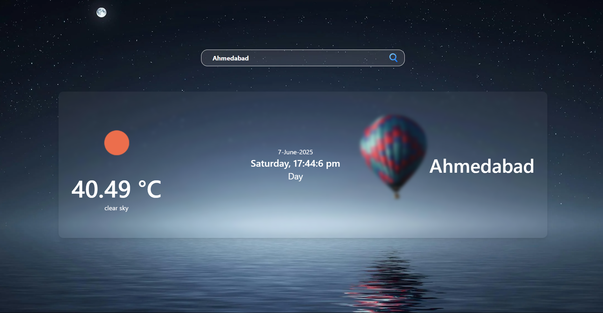
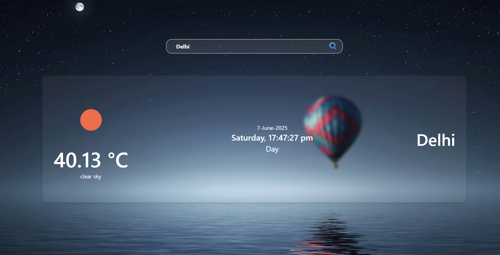
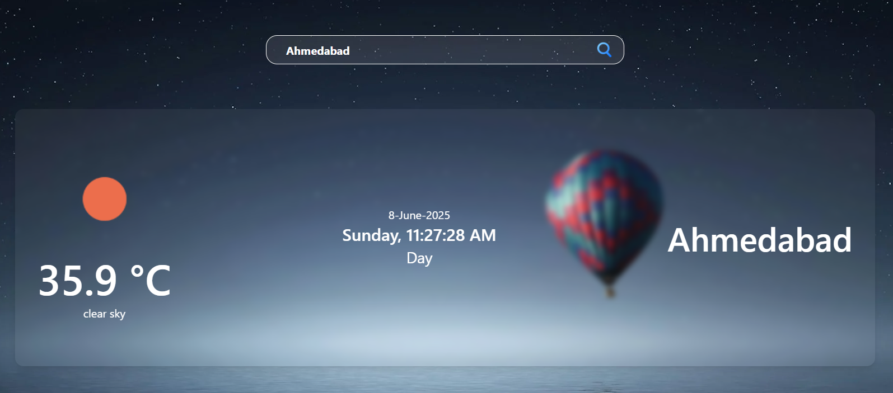
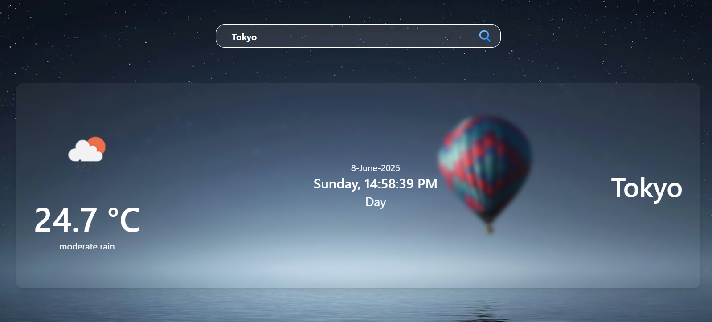

# 🌤️ SkyCast Genie - React Weather App

SkyCast Genie is a sleek, modern weather web app built using **React.js**. It allows users to check real-time weather conditions of any city using the **OpenWeatherMap API**. It features dynamic background, animated visuals, time updates, and a clean user interface.

---

## 🚀 Features

- 🔍 Search weather by city name
- 🌡️ Current temperature and weather description
- 🕒 Live time with seconds, date, AM/PM, Day

---

### 👉 Default City

### 👉 Search City

### 👉 Error (if any)

### Different TimeZone

